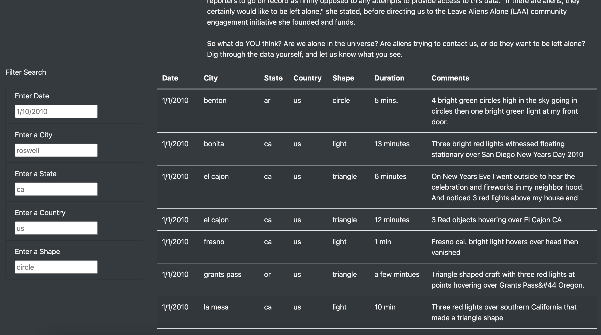
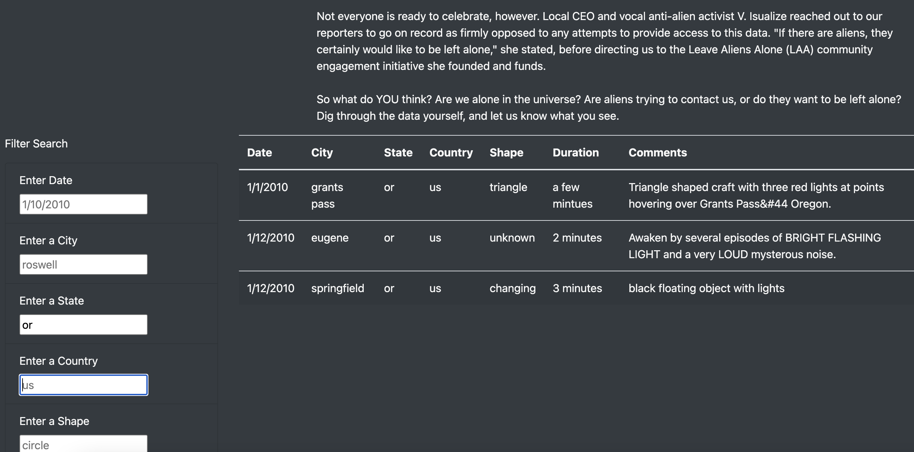
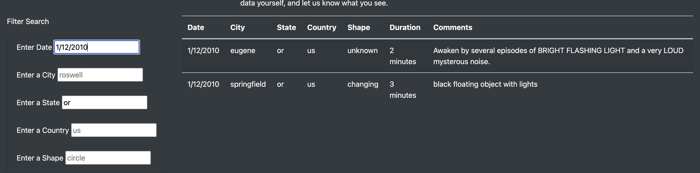
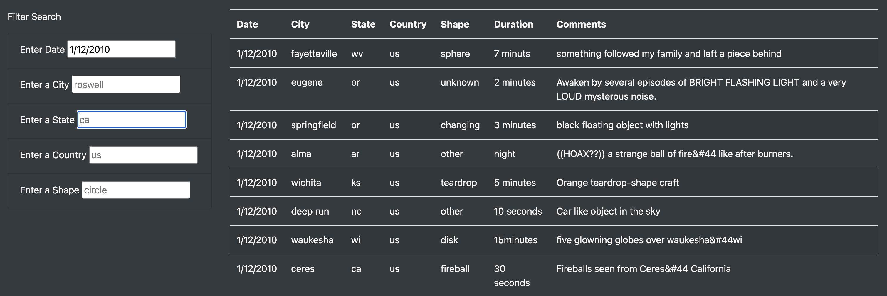
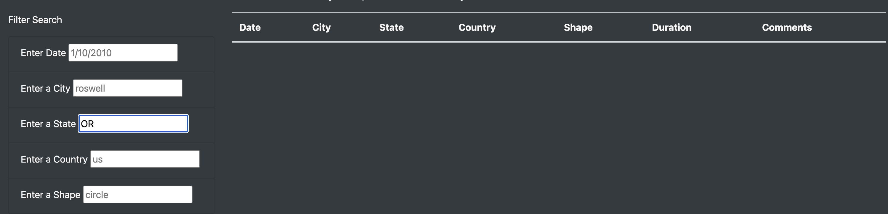

# UFOs
## Overview:
  The purpose of this project was to help a client improve the search engine of their UFO website to have more filters available for their users. The original website was already up and runnning with a intro paragraph, search tool by date of a UFO sighting and a table of information. The client tasked us with adding in additional filters: City, State, Country, and Shape. We modified the clients javascript code (app.js) as well as their html code (index.html) to provide the requested results. 
## Results:
### Entering the website

When the user enters the website, they will see the title in the top center and a few short paragraphs that are their to introduce the user to the idea behind UFOs as well as entice them to keep looking into the website further. Depending on the size of the users window, they may or may not have the abilty to see the search filters or information table unless they scroll down. 
### The Filter Search and Information Table

Whether the user needs to scroll or sees the filter and information table, once visible, the user has the ability to begin using the filter search located on the left side of the page. The user will see that each filter has an example input in each filter that will also assist in informing the user of the approrate formating for each input. On the right of the webpage, the user can see the fully populated table of information the website has to offer.
### Using the Filter Search

The user can begin filtering the table on the right using the filter search. The filter search can be filled out in any order. As the user fills out each filter, the table will get filtered when the user either clicks anywhere on the page or presses enter/return key. 

The user can keep adding more filters, in any order they want, and with the same steps as before, they can continue to filter the table. 

If the user would like the change any of the results, they simply go to that filter text and change it to another input or remove the text completely to remove any filtering from that filter category.
### Remove All Filters or Refresh the Filter Search Back to Orginal Status
The user can remove all filters by going to each of their inputs and deleting the text that applied to the filter until all are removed OR the user can refresh the webpage.
## Summary:

The summary addresses one drawback of this webpage (2 pt)
The summary addresses two additional recommendations for further development (4 pt)
